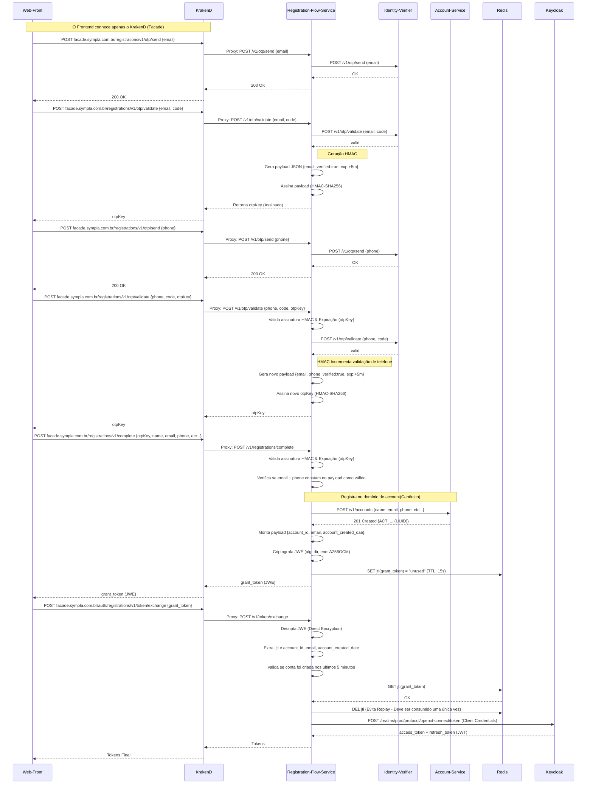

Minha jornada profissional começou na Masternet Telecom, onde atuei por mais de sete anos unindo desenvolvimento, redes e operação. Nesse período trabalhei com ERP web em PHP, automações em Python e Shell, além da manutenção de pipelines com GitLab e GitHub Actions.

Ao mesmo tempo, assumi responsabilidades fortes em infraestrutura: administração da rede do provedor, operação de BGP, OSPF e MPLS, configuração de ambientes GPON e gestão de switches L2/L3. Também mantive serviços críticos como DNS recursivo e autoritativo, FreeRadius, Apache, Nginx, bancos PostgreSQL e MySQL, além de observabilidade com Zabbix, Graylog, Grafana e PhpIPAM.

# Titulo

## titulo

### titulo 

